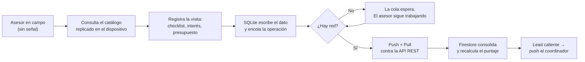
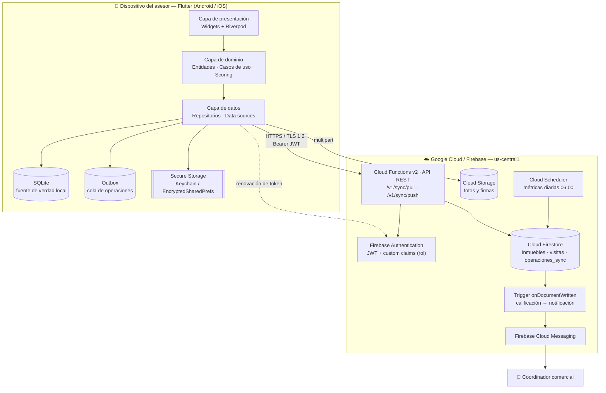
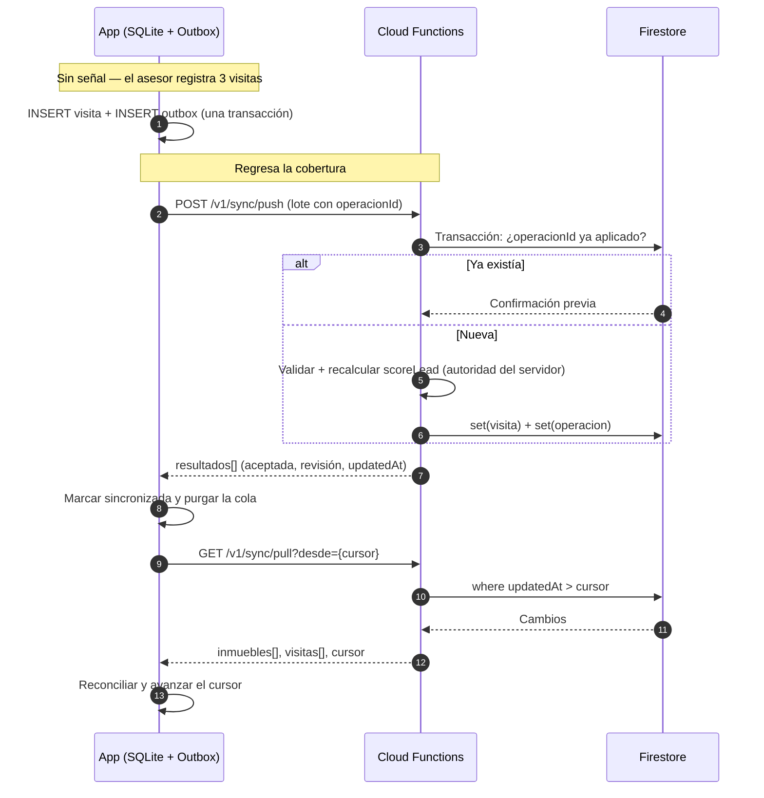

# InmoVisita

**Ecosistema móvil *offline-first* para el registro de visitas inmobiliarias en zonas con baja conectividad.**

[](../../actions/workflows/ci.yml)


> Taller ABP — Entrega 1 · Diseño de Aplicaciones Móviles
> Facultad de Ingeniería y Ciencias Ambientales · Católica del Norte Fundación Universitaria

---

## Tabla de contenido

1. [El problema](#1-el-problema)
2. [La solución](#2-la-solución)
3. [Arquitectura en la nube](#3-arquitectura-en-la-nube)
4. [Cómo funciona la sincronización](#4-cómo-funciona-la-sincronización)
5. [Estructura del repositorio](#5-estructura-del-repositorio)
6. [Puesta en marcha](#6-puesta-en-marcha)
7. [Despliegue en la nube](#7-despliegue-en-la-nube)
8. [Pruebas y evidencias](#8-pruebas-y-evidencias)
9. [Costos de operación](#9-costos-de-operación)
10. [Documentación técnica](#10-documentación-técnica)
11. [Presentación del proyecto](#11-presentación-del-proyecto)

---

## 1. El problema

Un asesor inmobiliario en Antioquia realiza entre **4 y 8 visitas diarias** a inmuebles ubicados en corregimientos, veredas, parcelaciones y edificaciones en obra gris. En esos puntos la señal de datos es intermitente o inexistente, de modo que las herramientas web de la agencia (CRM, fichas del inmueble, formularios) simplemente no cargan.

El resultado es un proceso de captura fragmentado:

| Etapa actual | Consecuencia |
|---|---|
| El asesor anota la visita en papel o en notas del teléfono | Datos incompletos y sin estructura |
| Envía fotos y comentarios sueltos por WhatsApp | Evidencia dispersa, sin trazabilidad |
| Al volver a la oficina retranscribe todo al CRM | **Doble digitación**, en promedio al final del día |
| El coordinador se entera del interés del cliente al día siguiente | Se pierde la ventana de contacto del lead |

Aunque la conectividad rural en Colombia pasó del 32,2 % de hogares en 2022 al **56,9 % en 2025**, sigue muy por debajo del promedio nacional de 73,9 %, y el propio Ministerio TIC señala que *"el principal desafío ya no es únicamente el acceso, sino lograr que la conectividad se traduzca en uso productivo"* ([MinTIC, 2026](https://www.mintic.gov.co/portal/715/w3-article-437305.html)). Diseñar asumiendo conexión permanente excluye precisamente al trabajador de campo.

### Pregunta problema

> **¿De qué manera el diseño de una aplicación móvil multiplataforma en Flutter, con arquitectura *offline-first* y un backend serverless en Firebase, permite eliminar la doble digitación y reducir a menos de 5 minutos el tiempo entre el cierre de una visita inmobiliaria y la disponibilidad del lead calificado para el coordinador, en zonas con conectividad intermitente?**

El análisis completo, con los objetivos SMART y la justificación tecnológica, está en [`docs/01-analisis-del-problema.md`](docs/01-analisis-del-problema.md).

---

## 2. La solución

InmoVisita es una aplicación móvil que **trata la red como un recurso opcional, no como un requisito**. Todo el flujo de trabajo del asesor —consultar el catálogo, registrar la visita, calificar al cliente, adjuntar evidencia— ocurre contra una base de datos SQLite en el dispositivo y responde de inmediato. La nube se sincroniza después, sola, cuando hay señal.

| Capacidad | Cómo se resuelve |
|---|---|
| Catálogo de inmuebles disponible sin señal | Réplica local con sincronización delta por `updatedAt` |
| Registro de visita completo en campo | Formulario con checklist, geolocalización y observaciones sobre SQLite |
| Calificación automática del lead | Modelo de puntaje de 6 factores (0–100) → frío / tibio / caliente |
| Cero pérdida de datos ante cortes | Patrón **Outbox transaccional** + reintentos con retroceso exponencial |
| Escrituras concurrentes | Reconciliación por contador de revisión + *last-write-wins* con detección de conflicto |
| Aviso inmediato al coordinador | Disparador de Firestore → notificación push (FCM) al detectarse un lead caliente |
| Seguridad del dato en el dispositivo | Tokens JWT en Keychain / EncryptedSharedPreferences, TLS 1.2+, reglas de Firestore |

### Vista funcional



---

## 3. Arquitectura en la nube

Arquitectura de tres capas con backend **serverless**: no hay servidores que administrar, el costo es proporcional al uso y la escala es automática.



### Justificación de cada servicio

| Servicio | Por qué se eligió | Alternativa descartada |
|---|---|---|
| **Flutter** | Un solo código fuente para Android e iOS; `sqflite` da SQLite nativo en ambas plataformas; el equipo de la agencia mantiene una sola base de código | Nativo duplicado (Kotlin + Swift): duplica el costo de mantenimiento |
| **Cloud Functions (v2)** | El tráfico es intermitente y en ráfagas (los asesores sincronizan al volver a cobertura); pagar por invocación es más barato que un servidor encendido 24/7 | VM o contenedor permanente: costo fijo sin uso continuo |
| **Cloud Firestore** | Consultas por rango de `updatedAt` (clave para la sincronización delta), transacciones ACID para la idempotencia y reglas de seguridad declarativas | SQL administrado: exige gestionar conexiones y esquema desde funciones efímeras |
| **Firebase Authentication** | Tokens JWT firmados con *custom claims* de rol, verificables tanto en la API como en las reglas de Firestore, con API REST que evita configuración nativa | Autenticación propia: reimplementar rotación de tokens es una fuente de fallas de seguridad |
| **Cloud Storage** | Las fotos no pueden viajar en el mismo documento; reglas por carpeta de asesor y límite de tamaño | Guardar imágenes en base64 en Firestore: rompe el límite de 1 MiB por documento |
| **FCM** | Es el canal push nativo de ambas tiendas y ya viene integrado con el proyecto | SMS o correo: mayor latencia y costo por mensaje |

Detalle completo en [`docs/02-arquitectura.md`](docs/02-arquitectura.md).

---

## 4. Cómo funciona la sincronización

El motor de sincronización es el núcleo técnico del proyecto. Combina cuatro mecanismos:

1. **Outbox transaccional** — cada escritura de negocio y su operación pendiente se guardan en la **misma transacción SQLite**. Si el proceso muere entre ambas, no queda un dato sin enviar ni un envío sin dato.
2. **Idempotencia por UUID de cliente** — el `operacionId` lo genera el dispositivo. El servidor lo registra en `operaciones_sync`; reenviar el lote tras un corte devuelve la confirmación original sin duplicar la visita.
3. **Sincronización delta con cursor** — el `pull` solo pide los registros con `updatedAt` mayor al último cursor confirmado, no el catálogo completo.
4. **Reconciliación explícita** — contador de revisión monótono; empate resuelto por marca de tiempo; escritura concurrente real marcada como conflicto en lugar de sobrescrita en silencio.



Fallos y reintentos: cada error incrementa el contador de la operación y programa el siguiente intento con **retroceso exponencial y *jitter*** (5 s → 10 s → 20 s → 40 s …, tope 15 min, ±20 % aleatorio) para evitar que todos los dispositivos golpeen el backend a la vez al recuperar señal. Los errores permanentes (validación, permisos) no se reintentan: se marcan como fallidos y quedan visibles en la pantalla de sincronización.

Detalle completo en [`docs/04-sincronizacion-offline.md`](docs/04-sincronizacion-offline.md).

---

## 5. Estructura del repositorio

```
inmovisita/
├── mobile/                      # Aplicación Flutter (cliente)
│   ├── lib/
│   │   ├── app/                 # Composición: providers, shell, tema
│   │   ├── core/                # Config, base de datos, red, errores, widgets
│   │   └── features/            # Feature-first + Clean Architecture
│   │       ├── auth/            #   domain / data / presentation
│   │       ├── inmuebles/
│   │       ├── visitas/
│   │       └── sync/            #   motor de sincronización
│   ├── test/                    # Pruebas unitarias y de integración local
│   ├── analysis_options.yaml    # Reglas de análisis estático
│   └── pubspec.yaml
│
├── backend/                     # Infraestructura serverless
│   ├── functions/
│   │   ├── src/
│   │   │   ├── dominio/         # Lógica pura (scoring, validación, reconciliación)
│   │   │   ├── api/             # Express: router, middleware, servicio de sync
│   │   │   ├── triggers/        # Firestore trigger + trabajo programado
│   │   │   └── infra/           # Inicialización de firebase-admin
│   │   └── test/                # Pruebas Jest de la lógica de dominio
│   ├── firestore.rules          # Reglas de seguridad (denegar por defecto)
│   ├── storage.rules
│   ├── firestore.indexes.json   # Índices compuestos
│   └── firebase.json            # Emuladores y despliegue
│
├── docs/                        # Documentación técnica
├── presentacion/                # Diapositivas del proyecto (PDF y PPTX)
├── scripts/                     # Siembra de datos de demostración
└── .github/workflows/ci.yml     # Integración continua
```

La separación por capas dentro de cada *feature* (`domain` / `data` / `presentation`) mantiene la regla de dependencia hacia adentro: el dominio no conoce a Flutter, a SQLite ni a HTTP, y por eso el 100 % de las reglas de negocio son probables sin emulador.

---

## 6. Puesta en marcha

### Opción A — Modo demostración (sin nube, 3 comandos)

La aplicación trae un catálogo sembrado y un usuario de prueba, de modo que se puede evaluar el flujo completo —incluido el comportamiento sin conexión— sin credenciales de Firebase.

```bash
git clone https://github.com/sgrlrichterl/inmovisita.git
cd inmovisita/mobile
flutter pub get
flutter run                      # DEMO_MODE está activo por defecto
```

Credenciales de demostración: `asesor@inmovisita.co` / `demo1234`

> Para comprobar el comportamiento offline: active el modo avión, registre dos o tres visitas (verá el aviso *"N registros pendientes por subir"*), desactívelo y observe cómo la cola se vacía sola.

### Opción B — Con backend local (emuladores de Firebase)

```bash
# 1. Compilar y levantar los emuladores
cd backend/functions && npm install && npm run build
cd .. && cp .firebaserc.example .firebaserc     # ajuste el projectId
firebase emulators:start --only functions,firestore,auth,storage

# 2. Sembrar catálogo y usuarios (en otra terminal)
cd ..
export FIRESTORE_EMULATOR_HOST=localhost:8080
export FIREBASE_AUTH_EMULATOR_HOST=localhost:9099
node scripts/sembrar_catalogo.js inmovisita-demo

# 3. Ejecutar la app apuntando al emulador
cd mobile
flutter run \
  --dart-define=DEMO_MODE=false \
  --dart-define=API_BASE_URL=http://10.0.2.2:5001/inmovisita-demo/us-central1/api \
  --dart-define=FIREBASE_API_KEY=demo-key
```

> `10.0.2.2` es la dirección con la que el emulador de Android alcanza el `localhost` de la máquina anfitriona.

**Ninguna credencial se escribe en el código fuente**: la configuración entra por `--dart-define` y el `.gitignore` excluye `google-services.json`, `.firebaserc` y cualquier clave de servicio.

---

## 7. Despliegue en la nube

```bash
# Requisitos: Node 20, Firebase CLI, un proyecto de Firebase con plan Blaze
npm install -g firebase-tools
firebase login

cd backend
cp .firebaserc.example .firebaserc      # coloque su projectId

firebase deploy --only firestore:rules,firestore:indexes,storage
firebase deploy --only functions
```

Publicación del cliente:

```bash
cd mobile
flutter build appbundle --release \
  --dart-define=DEMO_MODE=false \
  --dart-define=API_BASE_URL=https://us-central1-<projectId>.cloudfunctions.net/api \
  --dart-define=FIREBASE_API_KEY=<clave-web>
```

El procedimiento completo —asignación de roles, verificación post-despliegue y lista de comprobación de seguridad— está en [`docs/06-despliegue.md`](docs/06-despliegue.md).

---

## 8. Pruebas y evidencias

| Suite | Qué verifica | Cómo ejecutarla |
|---|---|---|
| `backend/functions/test` | Modelo de puntaje, validación de entrada, reconciliación de versiones y métricas | `cd backend/functions && npm test` |
| `mobile/test` | Puntaje en el cliente, resolución de conflictos, política de reintentos, flujo offline sobre SQLite real y motor de sincronización completo | `cd mobile && flutter test` |

Resultado de la última ejecución del backend en este repositorio:

```
PASS test/validacion.test.ts
PASS test/scoring.test.ts
PASS test/metricas.test.ts
PASS test/reconciliacion.test.ts
-------------------|---------|----------|---------|---------|
File               | % Stmts | % Branch | % Funcs | % Lines |
-------------------|---------|----------|---------|---------|
All files          |   96.21 |    79.27 |     100 |   96.39 |
 metricas.ts       |     100 |      100 |     100 |     100 |
 reconciliacion.ts |     100 |       90 |     100 |     100 |
 scoring.ts        |   98.07 |    88.46 |     100 |     100 |
 validacion.ts     |   92.45 |    73.23 |     100 |    92.3 |
-------------------|---------|----------|---------|---------|
Test Suites: 4 passed, 4 total
Tests:       32 passed, 32 total
```

Las pruebas del cliente incluyen un escenario de integración que abre una base **SQLite real en memoria** (`sqflite_common_ffi`) y comprueba que registrar una visita sin red deja exactamente una operación en la cola, que un rechazo permanente no se reintenta y que un fallo de red sí conserva la operación. La verificación de tipos, el análisis estático y ambas suites corren en cada `push` mediante [GitHub Actions](.github/workflows/ci.yml).

El detalle de casos y la matriz de trazabilidad requisito → prueba están en [`docs/07-pruebas-y-resultados.md`](docs/07-pruebas-y-resultados.md).

---

## 9. Costos de operación

Estimación para una agencia de **10 asesores** con 6 visitas diarias (≈ 1 300 visitas/mes):

| Concepto | Proveedor | Frecuencia | USD |
|---|---|---|---|
| Google Play Console | Google | Pago único de por vida | 25,00 |
| Apple Developer Program | Apple | Suscripción anual | 99,00 |
| Firestore + Functions + Storage | Google Cloud | Mensual estimado | 15,00 |
| Cloud Messaging (push) | Google | Mensual | 0,00 |
| **Total primer año** | | | **139,00** |

Con un presupuesto asignado de 300 USD queda un **53,7 % de holgura**. El desglose por operación, los supuestos de cálculo y el escenario de crecimiento a 50 asesores están en [`docs/08-costos.md`](docs/08-costos.md).

---

## 10. Documentación técnica

| Documento | Contenido |
|---|---|
| [`01-analisis-del-problema.md`](docs/01-analisis-del-problema.md) | Contexto, pregunta problema, objetivos SMART, justificación tecnológica |
| [`02-arquitectura.md`](docs/02-arquitectura.md) | Vistas C4, decisiones de arquitectura (ADR) y estructura de capas |
| [`03-modelo-de-datos.md`](docs/03-modelo-de-datos.md) | Esquema SQLite, colecciones de Firestore y modelo de calificación de leads |
| [`04-sincronizacion-offline.md`](docs/04-sincronizacion-offline.md) | Outbox, idempotencia, cursor delta, conflictos y reintentos |
| [`05-seguridad.md`](docs/05-seguridad.md) | Autenticación, autorización por rol, cifrado en dispositivo y análisis de amenazas |
| [`06-despliegue.md`](docs/06-despliegue.md) | Guía paso a paso de despliegue y verificación |
| [`07-pruebas-y-resultados.md`](docs/07-pruebas-y-resultados.md) | Estrategia de pruebas, resultados y trazabilidad |
| [`08-costos.md`](docs/08-costos.md) | Simulador de costos y proyección |
| [`09-formulario-canvas.md`](docs/09-formulario-canvas.md) | Respuestas al formulario "Ecosistema Interactivo Mobile" |

---

## 11. Presentación del proyecto

Las diapositivas ejecutivas y técnicas están en la carpeta [`presentacion/`](presentacion/):

- `InmoVisita-Presentacion.pdf` — versión para lectura y entrega
- `InmoVisita-Presentacion.pptx` — versión editable

---

## Licencia

Distribuido bajo licencia MIT. Ver [`LICENSE`](LICENSE).

**Fuentes citadas**

- Ministerio TIC de Colombia. *Gobierno conectó 3,5 millones de hogares en tres años y, por primera vez, más de la mitad de los hogares rurales tienen internet* (2026). https://www.mintic.gov.co/portal/715/w3-article-437305.html
