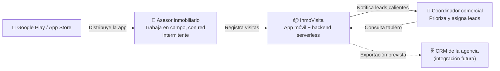
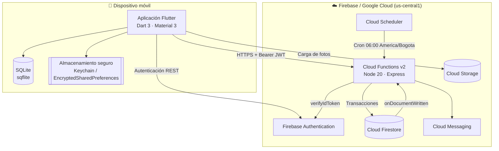
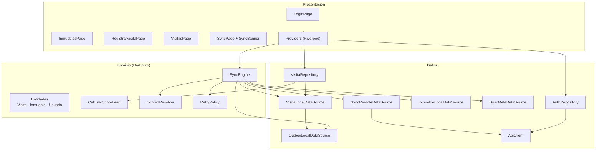

# 2. Arquitectura de la solución

## 2.1 Principios rectores

| Principio | Cómo se materializa en el código |
|---|---|
| **Offline-first** | La interfaz nunca espera a la red: lee y escribe siempre contra SQLite. La red es un proceso de fondo |
| **Regla de dependencia hacia adentro** | `presentation → data → domain`. El dominio no importa Flutter, SQLite ni HTTP |
| **El servidor es la autoridad** | El dispositivo propone; la Cloud Function valida, recalcula el puntaje y decide la revisión final |
| **Fallar de forma visible** | Ningún error se traga: la cola de salida expone pendientes, fallidos y el último error al usuario |
| **Denegar por defecto** | Las reglas de Firestore y Storage cierran todo y abren solo lo indispensable |
| **Configuración fuera del código** | Endpoints y llaves entran por `--dart-define`; nada de secretos versionados |

## 2.2 Vista de contexto (C4 nivel 1)



## 2.3 Vista de contenedores (C4 nivel 2)



## 2.4 Vista de componentes del cliente (C4 nivel 3)



**Por qué `SyncEngine` vive en `domain`:** su lógica —en qué orden empujar y traer, cuándo reintentar, cómo reconciliar— es una regla de negocio, no un detalle de transporte. Depende de la interfaz `SyncApi`, no del `ApiClient` concreto, y por eso se prueba con un doble de prueba sin tocar la red.

## 2.5 Estructura de paquetes

```
lib/
├── app/                      # Composición de la aplicación
│   ├── providers.dart        #   grafo de dependencias (Riverpod)
│   ├── app.dart              #   MaterialApp y enrutamiento raíz
│   └── home_shell.dart       #   navegación principal
├── core/                     # Transversal, sin reglas de negocio
│   ├── config/               #   AppConfig (--dart-define)
│   ├── db/                   #   AppDatabase: esquema y migraciones
│   ├── errors/               #   Failure (dominio) y Exception (técnicas)
│   ├── network/              #   ApiClient, ConnectivityService
│   ├── theme/  utils/  widgets/
└── features/                 # Un módulo por capacidad de negocio
    ├── auth/{domain,data,presentation}
    ├── inmuebles/{domain,data,presentation}
    ├── visitas/{domain,data,presentation}
    └── sync/{domain,data,presentation}
```

La organización es **feature-first**: al agregar una capacidad nueva (por ejemplo, "avalúos") se crea una carpeta con sus tres capas, sin tocar las existentes. Dentro de cada *feature*, Clean Architecture mantiene el dominio aislado.

## 2.6 Decisiones de arquitectura (ADR resumidos)

### ADR-01 · SQLite como fuente de verdad local, no como caché

**Contexto.** La aplicación debe permitir crear y editar datos sin red, no solo leer.
**Decisión.** La interfaz lee y escribe exclusivamente en SQLite; la nube es un destino de replicación.
**Consecuencias.** (+) La app responde igual con o sin señal; el estado sobrevive al cierre del proceso. (−) Obliga a resolver conflictos explícitamente y a versionar el esquema local con migraciones.

### ADR-02 · Patrón Outbox transaccional

**Contexto.** Guardar la visita y luego "recordar enviarla" abre una ventana en la que el proceso puede morir y el dato queda huérfano.
**Decisión.** La visita y su operación pendiente se insertan en la **misma transacción SQLite**.
**Consecuencias.** (+) Garantía de entrega *at-least-once* sin datos perdidos. (−) Exige idempotencia en el servidor, porque la misma operación puede llegar más de una vez.

### ADR-03 · Idempotencia mediante UUID generado en el cliente

**Contexto.** Un reintento tras un corte de red no debe duplicar la visita.
**Decisión.** El dispositivo genera `operacionId` (UUID v4) y el servidor lo registra en `operaciones_sync` dentro de la misma transacción que la escritura.
**Consecuencias.** (+) Reenviar un lote es seguro. (−) La colección de operaciones crece y requiere una política de retención (TTL de 90 días).

### ADR-04 · Revisión monótona + LWW con detección de conflicto

**Contexto.** Dos dispositivos pueden editar la misma visita mientras están desconectados.
**Decisión.** Contador `revision` que solo el servidor incrementa; en empate desempata `updatedAt`; si ambas copias cambiaron desde la última sincronización, se marca conflicto en lugar de sobrescribir.
**Consecuencias.** (+) No hay pérdida silenciosa. (−) Alguien debe revisar los conflictos marcados; se expone en la pantalla de sincronización.

### ADR-05 · API REST versionada sobre Cloud Functions, en vez del SDK de Firestore en el cliente

**Contexto.** Se podría escribir directamente en Firestore desde la app.
**Decisión.** Toda escritura pasa por `/v1/sync/push`.
**Consecuencias.** (+) El servidor valida, normaliza y recalcula el puntaje; el esquema puede evolucionar sin romper apps instaladas; las reglas de Firestore quedan como segunda barrera. (−) Un salto de red adicional y una función que mantener.

### ADR-06 · Autenticación por API REST de Identity Platform en lugar del SDK nativo

**Contexto.** El SDK nativo exige `google-services.json` / `GoogleService-Info.plist`, archivos que no deben versionarse y que impiden compilar el proyecto recién clonado.
**Decisión.** Iniciar sesión y renovar el token contra la API REST usando `http`.
**Consecuencias.** (+) El repositorio compila y se ejecuta sin credenciales; las pruebas no requieren plataformas nativas. (−) La rotación del token se implementa en `AuthRepository` (30 líneas, cubiertas por pruebas).

## 2.7 Atributos de calidad

| Atributo | Táctica aplicada | Cómo se evidencia |
|---|---|---|
| **Disponibilidad** | Fuente de verdad local; degradación elegante ante falta de red | La app opera completa en modo avión |
| **Escalabilidad** | Backend serverless con escalado automático y `maxInstances: 10` | El tráfico en ráfaga no requiere aprovisionamiento |
| **Modificabilidad** | Feature-first + Clean Architecture + inversión de dependencias | Agregar una entidad sincronizable no altera `SyncEngine` |
| **Testabilidad** | Dominio en Dart/TS puro; `SyncApi` como interfaz; SQLite en memoria | 32 pruebas de backend + 5 suites de cliente sin emuladores |
| **Seguridad** | JWT con *claims* de rol, reglas denegar-por-defecto, almacenamiento cifrado | Ver `05-seguridad.md` |
| **Eficiencia** | Sincronización delta por cursor, envío por lotes, retroceso exponencial con *jitter* | Solo viajan los registros modificados |
| **Observabilidad** | `ReporteSync` por ciclo, métricas diarias agregadas, registros estructurados | Pantalla de sincronización + colección `metricas_diarias` |
