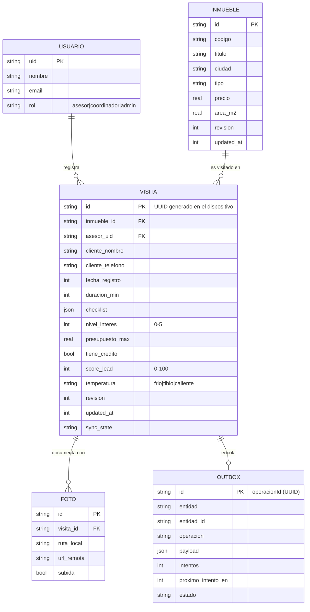

# 3. Modelo de datos

## 3.1 Modelo conceptual



## 3.2 Esquema local (SQLite, versión 1)

Definido en `mobile/lib/core/db/app_database.dart`.

| Tabla | Propósito | Índices |
|---|---|---|
| `usuarios` | Perfil del usuario autenticado | PK `uid` |
| `inmuebles` | Réplica local del catálogo | `(ciudad, estado)`, `(updated_at)` |
| `visitas` | Registros creados en campo | `(asesor_uid, fecha_registro)`, `(sync_state)` |
| `visita_fotos` | Evidencia fotográfica pendiente de subir | `(visita_id)` |
| `outbox` | Cola de operaciones remotas | `(estado, proximo_intento_en)` |
| `sync_meta` | Cursor de sincronización y marcas de tiempo | PK `clave` |

Notas de diseño:

- **Claves foráneas activas.** `PRAGMA foreign_keys = ON` en `onConfigure`; borrar una visita arrastra sus fotos.
- **Marcas de tiempo como enteros.** Se guarda *epoch* en milisegundos (`INTEGER`), no texto: comparaciones exactas y baratas para el cursor delta.
- **Borrado lógico.** La columna `eliminado` evita que un registro borrado en un dispositivo reaparezca al sincronizar con otro que aún no conoce el borrado.
- **`checklist` como JSON.** El conjunto de ítems evoluciona con el negocio; normalizarlo en una tabla obligaría a migrar el esquema con cada cambio de formulario.
- **Migraciones versionadas.** `schemaVersion` y `_onUpgrade` permiten evolucionar el esquema sin reinstalar la app ni perder las visitas pendientes.

## 3.3 Colecciones en Firestore

| Colección | Documento | Contenido | Quién escribe |
|---|---|---|---|
| `inmuebles` | `inm-001` | Catálogo comercial, `updatedAt` para el delta | Backend / carga inicial |
| `visitas` | UUID del dispositivo | Visita consolidada con `scoreLead` y `revision` autoritativos | Cloud Function |
| `usuarios` | `uid` de Auth | Perfil, `rol` y `fcmToken` | Backend (rol) / usuario (solo `fcmToken`) |
| `operaciones_sync` | `operacionId` | Registro de idempotencia con la confirmación emitida | Cloud Function |
| `metricas_diarias` | `YYYY-MM-DD` | Indicadores agregados del día | Trabajo programado |

**Índices compuestos** (`backend/firestore.indexes.json`): `(asesorUid, updatedAt)` para el `pull` de un asesor, `(temperatura, updatedAt desc)` para el tablero de leads calientes, `(asesorUid, fechaRegistro desc)` para el historial y `(ciudad, updatedAt)` para el catálogo por ciudad.

**Retención.** `operaciones_sync` crece con cada escritura; se recomienda una política TTL de 90 días sobre el campo `registradaEn`, plazo muy superior al máximo tiempo que un dispositivo puede permanecer sin sincronizar.

## 3.4 Modelo de calificación de leads

El puntaje es una **suma ponderada de seis factores observables durante la visita**, en el rango 0–100. Se implementa dos veces —`CalcularScoreLead` en Dart y `calcularScoreLead` en TypeScript— con pruebas equivalentes que fijan los mismos valores esperados. La versión del servidor es la que queda almacenada.

| Factor | Peso | Regla |
|---|---:|---|
| Nivel de interés | 30 | `round(nivel / 5 × 30)`, con `nivel` en 0–5 |
| Capacidad de compra | 25 | ratio = presupuesto ÷ precio → ≥1,00 : 25 · ≥0,90 : 20 · ≥0,80 : 12 · ≥0,60 : 6 · resto : 0 |
| Crédito preaprobado | 15 | 15 si el cliente lo declara, 0 en caso contrario |
| Duración de la visita | 10 | ≥30 min : 10 · ≥15 : 6 · ≥5 : 3 · resto : 0 |
| Checklist completado | 10 | `round(proporción marcada × 10)` sobre los 6 ítems estándar |
| Evidencia registrada | 10 | Observaciones ≥40 car. : 5 (≥15 car. : 2) + fotos ≥3 : 5 (≥1 : 2) |
| **Total** | **100** | |

**Clasificación:** `≥ 70 → caliente`, `≥ 45 → tibio`, resto `frío`.

**Por qué estos factores.** Los tres primeros miden intención y capacidad reales del cliente —el 70 % del peso—. Los tres últimos miden la **calidad del registro**: una visita larga, con checklist completo y evidencia, no solo indica interés sino que produce un dato utilizable por el coordinador. El modelo premia, así, tanto al buen lead como al buen registro.

**Transparencia.** `ResultadoScore.desglose` devuelve el aporte de cada factor, y la aplicación lo muestra en pantalla mientras el asesor diligencia el formulario. El modelo es auditable y sus pesos se pueden recalibrar sin tocar el resto del sistema.

**Limitación reconocida.** Los pesos son una hipótesis inicial fundada en la práctica comercial, no un modelo estadístico. La proyección investigativa consiste en contrastar el puntaje contra el desenlace real de cada lead (visita → negociación → cierre) y recalibrar los pesos por regresión logística, convirtiendo la heurística en un modelo predictivo validado.

## 3.5 Contrato de la API

Base: `https://<region>-<projectId>.cloudfunctions.net/api`

| Método | Ruta | Autenticación | Descripción |
|---|---|---|---|
| `GET` | `/v1/salud` | Pública | Sonda de disponibilidad |
| `GET` | `/v1/sync/pull?desde={ms}&limite={n}` | Bearer JWT | Cambios posteriores al cursor |
| `POST` | `/v1/sync/push` | Bearer JWT | Lote de operaciones pendientes |
| `GET` | `/v1/leads` | Bearer JWT + rol coordinador | Leads calientes del equipo |
| `GET` | `/v1/metricas` | Bearer JWT + rol coordinador | Métricas diarias agregadas |

**Ejemplo — `POST /v1/sync/push`**

```jsonc
{
  "operaciones": [
    {
      "operacionId": "8f14e45f-ea3e-4a1d-9c1f-1b2c3d4e5f60",
      "entidad": "visitas",
      "entidadId": "c0ffee00-1111-2222-3333-444455556666",
      "operacion": "crear",
      "payload": {
        "id": "c0ffee00-1111-2222-3333-444455556666",
        "inmuebleId": "inm-001",
        "clienteNombre": "Maria Restrepo",
        "clienteTelefono": "3105550123",
        "nivelInteres": 5,
        "presupuestoMax": 640000000,
        "tieneCredito": true,
        "duracionMin": 35,
        "checklist": { "documentos_verificados": true },
        "revision": 1,
        "updatedAt": 1756400000000
      }
    }
  ]
}
```

**Respuesta**

```jsonc
{
  "resultados": [
    {
      "operacionId": "8f14e45f-ea3e-4a1d-9c1f-1b2c3d4e5f60",
      "entidadId": "c0ffee00-1111-2222-3333-444455556666",
      "aceptada": true,
      "revision": 2,
      "updatedAt": 1756400123456,
      "reintentable": true
    }
  ]
}
```

Campos ignorados deliberadamente del `payload`: `asesorUid` (se toma del token), `scoreLead` y `temperatura` (los recalcula el servidor). El dispositivo **no es una fuente confiable** para ninguno de ellos; hay pruebas que lo verifican (`test/validacion.test.ts`).
