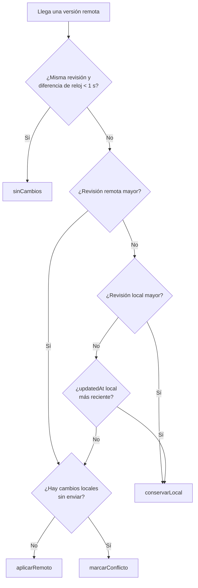

# 4. Motor de sincronización offline-first

Este documento describe el componente técnicamente más delicado del proyecto. Todo lo que sigue está implementado en `mobile/lib/features/sync/` y en `backend/functions/src/api/sync_service.ts`, y verificado por las suites indicadas al final.

## 4.1 El problema que resuelve

Sincronizar no es "guardar cuando haya internet". Son cuatro problemas distintos que se resuelven con mecanismos distintos:

| Problema | Si no se resuelve | Mecanismo aplicado |
|---|---|---|
| El proceso muere entre guardar y enviar | El dato existe pero nunca sale del teléfono | **Outbox transaccional** |
| Un reintento tras un corte de red reenvía lo mismo | Visitas duplicadas en el CRM | **Idempotencia por UUID de cliente** |
| Traer todo el catálogo en cada ciclo | Consumo de datos y batería inaceptable en campo | **Sincronización delta con cursor** |
| Dos dispositivos editan el mismo registro | Pérdida silenciosa de datos | **Revisión monótona + LWW con detección de conflicto** |

## 4.2 Outbox transaccional

```dart
// mobile/lib/features/visitas/data/visita_local_data_source.dart
await _db.transaction((txn) async {
  await txn.insert(tabla, visita.toMap(), conflictAlgorithm: ConflictAlgorithm.replace);
  await _outbox.encolar(OutboxItem(...), txn: txn);   // misma transacción
});
```

La visita y su operación pendiente se confirman juntas o no se confirma ninguna. No existe un estado intermedio en el que el dato esté guardado pero nadie recuerde enviarlo, ni uno en el que haya una operación encolada sobre un dato inexistente.

La cola vive en la tabla `outbox`, con los campos que permiten operarla: `intentos`, `ultimo_error`, `proximo_intento_en` y `estado` (`pendiente` · `enviando` · `enviado` · `fallido`).

## 4.3 Idempotencia

El `operacionId` es un **UUID v4 generado en el dispositivo**, no en el servidor. Esto convierte el envío en una operación segura de repetir:

```typescript
// backend/functions/src/api/sync_service.ts
return db.runTransaction(async (tx) => {
  const yaAplicada = await tx.get(refOperacion);
  if (yaAplicada.exists) {
    return {...yaAplicada.data(), operacionId: sobre.operacionId};  // misma respuesta
  }
  // ... validar, recalcular puntaje, escribir visita + registro de operación
});
```

La escritura de la visita y el registro de la operación ocurren en **una transacción de Firestore**: no puede quedar una visita aplicada sin su marca de idempotencia. El escenario clásico —el servidor procesa, la respuesta se pierde por el corte, el cliente reenvía— termina devolviendo la confirmación original en lugar de crear un duplicado.

## 4.4 Sincronización delta con cursor

El cliente guarda en `sync_meta` la marca de tiempo del cambio más reciente que recibió (`cursor_pull`) y solo pide lo posterior:

```
GET /v1/sync/pull?desde=1756400000000&limite=200
```

El servidor consulta `where updatedAt > desde order by updatedAt asc limit n`, sostenida por los índices compuestos. Devuelve `cursor` (el mayor `updatedAt` entregado) y `hayMas` cuando truncó la página, de modo que el cliente sabe que debe volver a pedir.

**Filtrado por rol en el servidor, no en el cliente:** un asesor solo recibe sus propias visitas (`where asesorUid == uid`); un coordinador recibe las del equipo. El rol se lee del token, nunca de un parámetro.

## 4.5 Orden de las fases: primero push, después pull

```dart
final push = await _ejecutarPush(remoto);
final pull = await _ejecutarPull(remoto);
```

El orden importa. Si se hiciera primero el `pull`, los cambios locales que aún no han salido podrían ser sobrescritos por una versión del servidor que todavía no los conoce. Empujando primero, el `pull` posterior trae el estado ya consolidado, incluida la revisión que el servidor asignó a lo recién enviado.

## 4.6 Reconciliación de conflictos

### En el dispositivo (`ConflictResolver`)



La **tolerancia de reloj de 1 segundo** existe porque los relojes de los teléfonos no están sincronizados con el servidor; sin ella, diferencias de milisegundos producirían escrituras innecesarias en cada ciclo.

La rama `marcarConflicto` es la diferencia frente a un *last-write-wins* puro: cuando ambas copias cambiaron desde la última sincronización, el conflicto se contabiliza en `ReporteSync.conflictos` y queda visible en la pantalla de sincronización, en lugar de descartarse en silencio.

### En el servidor (`decidirEscritura`)

| Estado almacenado | Escritura entrante | Decisión |
|---|---|---|
| No existe | cualquiera | `aplicar` (creación) |
| revisión y `updatedAt` iguales | idéntica | `sin-cambios` |
| revisión entrante ≥ almacenada | — | `aplicar` |
| revisión menor pero `updatedAt` posterior | dispositivo mucho tiempo offline | `aplicar` |
| revisión menor y `updatedAt` anterior | — | `rechazar-obsoleta` (**no reintentable**) |

`siguienteRevision` siempre avanza desde la revisión más alta conocida, de modo que el contador es monótono aunque el cliente envíe valores repetidos o menores.

## 4.7 Reintentos: retroceso exponencial con *jitter*

```dart
// mobile/lib/features/sync/domain/retry_policy.dart
Duration esperaPara(int intentos, {Random? random});
```

| Intento | Espera base | Con jitter ±20 % |
|---:|---:|---|
| 1 | 5 s | 4–6 s |
| 2 | 10 s | 8–12 s |
| 3 | 20 s | 16–24 s |
| 4 | 40 s | 32–48 s |
| 5 | 80 s | 64–96 s |
| … | tope 15 min | |

Tras 5 intentos la operación se marca como `fallido` y deja de consumir batería y datos; queda listada para reintento manual desde la interfaz.

**Por qué el jitter.** Cuando una torre celular vuelve a dar cobertura, decenas de dispositivos recuperan la red en el mismo segundo. Sin aleatoriedad, todos reintentarían exactamente a los 5, 10 y 20 segundos, concentrando el tráfico en picos y disparando arranques en frío del backend. El jitter proporcional dispersa esa carga.

**Clasificación de errores:**

| Error | ¿Reintentable? | Razón |
|---|---|---|
| Sin red / *timeout* | Sí | Es transitorio por definición |
| HTTP 5xx | Sí | Fallo del servidor, puede resolverse |
| HTTP 401 / 403 | Sí (una vez) | Puede ser un token vencido; `AuthRepository` lo renueva |
| Validación rechazada por el servidor | **No** | Reenviar el mismo dato producirá el mismo rechazo |
| Versión obsoleta | **No** | El `pull` traerá el estado correcto |

## 4.8 Cuándo se dispara la sincronización

1. **Al recuperar conectividad** — `ConnectivityService.onStatusChange` emite `true` y dispara un ciclo inmediato.
2. **Periódicamente** — temporizador de 120 s configurable (`AppConfig.syncIntervalSeconds`).
3. **A petición del usuario** — botón *Sincronizar ahora* y toque sobre la franja de estado.

Un candado de reentrada (`_enCurso`) impide que dos ciclos se solapen: si el temporizador dispara mientras el usuario ya lanzó uno manual, el segundo se omite.

`sincronizar()` **nunca lanza excepciones**: todo fallo se reporta en `ReporteSync`, de modo que un error puntual no rompe el ciclo periódico.

## 4.9 Verificación

| Escenario | Prueba |
|---|---|
| El registro offline deja exactamente una operación en cola | `mobile/test/data/visita_repository_test.dart` |
| Dos registros idénticos generan identificadores distintos | ídem (idempotencia por UUID) |
| La cola se vacía y la visita queda `sincronizada` | `mobile/test/sync/sync_engine_test.dart` |
| Un rechazo permanente marca `fallido` y no se reintenta | ídem |
| Un fallo de red conserva la operación en cola | ídem |
| El cursor avanza y se aplican los cambios remotos | ídem |
| Las siete ramas del resolvedor de conflictos | `mobile/test/sync/conflict_resolver_test.dart` |
| La progresión y el tope del retroceso exponencial | `mobile/test/sync/retry_policy_test.dart` |
| Las cinco reglas de decisión del servidor | `backend/functions/test/reconciliacion.test.ts` |
| La monotonía del contador de revisión ante reenvíos | ídem |

## 4.10 Limitaciones conocidas y trabajo futuro

- **Granularidad del conflicto.** La reconciliación opera sobre el documento completo. Una fusión campo a campo (CRDT) permitiría que dos ediciones de campos distintos convivan sin conflicto.
- **Sincronización en segundo plano.** Hoy el ciclo requiere la app en primer plano. `WorkManager` (Android) y `BGTaskScheduler` (iOS) permitirían sincronizar con la aplicación cerrada.
- **Fotografías.** El esquema y la interfaz de datos están listos, pero la carga a Cloud Storage con reanudación quedó fuera del alcance de esta entrega.
- **Compresión del lote.** Con más de 200 operaciones acumuladas convendría comprimir el cuerpo (gzip) para reducir el consumo de datos móviles.
