# 5. Estrategia de seguridad

## 5.1 Superficies y controles

```mermaid
flowchart LR
    subgraph D["📱 Dispositivo"]
        D1["Tokens en almacenamiento cifrado<br/>Keychain / EncryptedSharedPreferences"]
        D2["Base local sin datos de tarjetas<br/>ni documentos de identidad"]
        D3["Sin secretos compilados<br/>(--dart-define)"]
    end
    subgraph T["🔒 Transporte"]
        T1["HTTPS obligatorio · TLS 1.2+"]
        T2["Authorization: Bearer JWT"]
    end
    subgraph N["☁️ Nube"]
        N1["verifyIdToken con revocación"]
        N2["Autorización por rol (custom claims)"]
        N3["Validación de toda entrada"]
        N4["Reglas Firestore/Storage: denegar por defecto"]
        N5["maxInstances: límite de gasto"]
    end
    D --> T --> N
```



## 5.2 Autenticación

- **Firebase Authentication (Identity Platform)** emite un `idToken` JWT con vigencia de una hora y un `refreshToken` de larga duración.
- El cliente considera el token vencido **5 minutos antes** de su expiración real (`TokensSesion.vencido`), lo que evita carreras por desfase de reloj entre el teléfono y el servidor.
- La renovación es transparente: `AuthRepository.tokenActual()` actúa como `TokenProvider` del `ApiClient` y refresca el token justo antes de cada petición si hace falta.
- **Sin red no se cierra la sesión.** Si el refresco falla por falta de conectividad se devuelve el token vigente: la petición fallará y la operación permanecerá en la cola. Cerrar sesión en ese momento haría perder el trabajo de campo del asesor, que es justamente lo que el sistema debe proteger.
- Un `UnauthorizedException` en el refresco (token revocado, cuenta deshabilitada) sí cierra la sesión y borra las credenciales.

## 5.3 Autorización

El rol viaja como *custom claim* dentro del token **firmado por Firebase**, no como un campo del cuerpo de la petición ni de la base local. El cliente no puede modificarlo.

```typescript
const decodificado = await auth.verifyIdToken(token, true); // true = comprobar revocación
req.identidad = {uid: decodificado.uid, rol: decodificado.rol ?? "asesor"};
```

Solo `asignarRol` —una función invocable restringida a `admin`— puede cambiar el rol de un usuario, y lo hace con `setCustomUserClaims`.

| Recurso | asesor | coordinador | admin |
|---|---|---|---|
| Catálogo de inmuebles | leer | leer | leer |
| Sus propias visitas | leer / escribir vía API | — | — |
| Visitas del equipo | ✗ | leer | leer |
| `/v1/leads`, `/v1/metricas` | ✗ | ✓ | ✓ |
| Asignar roles | ✗ | ✗ | ✓ |

## 5.4 Almacenamiento en el dispositivo

```dart
const FlutterSecureStorage(
  aOptions: AndroidOptions(encryptedSharedPreferences: true),
  iOptions: IOSOptions(
    accessibility: KeychainAccessibility.first_unlock_this_device,
  ),
);
```

- **Android:** `EncryptedSharedPreferences`, respaldado por el Android Keystore (llave en hardware cuando el dispositivo lo soporta).
- **iOS:** Keychain con `first_unlock_this_device`: el dato no se restaura en otro dispositivo desde una copia de seguridad y no es accesible hasta el primer desbloqueo tras encender el teléfono.
- La base SQLite guarda datos operativos (visitas, catálogo), **no** documentos de identidad, datos financieros del cliente ni credenciales. El presupuesto declarado es un rango comercial, no información bancaria.
- `AppDatabase.wipe()` limpia todas las tablas de negocio al cerrar sesión, para el caso de dispositivos compartidos entre turnos.

## 5.5 Validación de entrada

**Toda entrada del dispositivo se considera hostil.** El módulo `dominio/validacion.ts` valida forma, tipos y rangos antes de tocar Firestore:

| Campo | Regla |
|---|---|
| `operacionId`, `entidadId`, `id` | Cadena de al menos 8 caracteres |
| `entidad`, `operacion` | Lista blanca de valores permitidos |
| `clienteNombre` | Mínimo 3 caracteres, recortado |
| `clienteTelefono` | Mínimo 7 dígitos tras eliminar separadores |
| `clienteEmail` | Expresión regular, solo si viene informado |
| `nivelInteres` | 0 a 5 |
| `duracionMin` | 0 a 600 |
| `presupuestoMax` | No negativo |
| `observaciones` | Recortado a 2 000 caracteres |
| Tamaño del cuerpo | `express.json({limit: "1mb"})` |
| Operaciones por lote | Máximo 500 |

**Campos del cuerpo que el servidor ignora deliberadamente:**

| Campo | Motivo | Prueba que lo verifica |
|---|---|---|
| `asesorUid` | Se toma del token; si no, un asesor podría registrar visitas a nombre de otro | `validacion.test.ts` → *"toma el asesor del token"* |
| `scoreLead`, `temperatura` | Los recalcula el servidor; si no, se podría inflar la prioridad de un lead | `validacion.test.ts` → *"no confía en el puntaje enviado"* |
| `revision` | El servidor asigna la revisión final | `reconciliacion.test.ts` |

## 5.6 Reglas de Firestore y Storage

Ambos archivos parten de **denegar todo** y abren únicamente lo indispensable. Las escrituras de negocio no se hacen desde el cliente —pasan por la API con el SDK de administrador—, así que las reglas actúan como **segunda barrera** frente a un intento de escritura directa con el SDK cliente.

```javascript
// Un asesor solo lee sus propias visitas
match /visitas/{visitaId} {
  allow read: if esCoordinador() || esDuenio(resource.data.asesorUid);
  allow create, update, delete: if false;
}

// El usuario solo puede actualizar su token de notificaciones
match /usuarios/{uid} {
  allow update: if esDuenio(uid)
    && request.resource.data.diff(resource.data).affectedKeys()
         .hasOnly(['fcmToken', 'updatedAt']);
}
```

En Storage, cada asesor escribe únicamente bajo `visitas/{suUid}/...`, con límite de 5 MB y tipo MIME restringido a `image/jpeg|png|webp`. El borrado está prohibido: la evidencia de una visita no debe poder eliminarse desde el dispositivo.

## 5.7 Gestión de secretos

| Elemento | Dónde vive | Cómo se protege |
|---|---|---|
| `API_BASE_URL`, `FIREBASE_API_KEY` | `--dart-define` en tiempo de compilación | No están en el repositorio |
| `google-services.json`, `GoogleService-Info.plist` | Máquina del desarrollador | Excluidos en `.gitignore` |
| Clave de cuenta de servicio | Google Cloud | Nunca se descarga; las funciones usan credenciales implícitas |
| `.firebaserc` (projectId) | Local | Se versiona solo `.firebaserc.example` |

> La *API key* web de Firebase no es un secreto en el sentido clásico —identifica al proyecto, no autoriza—, pero mantenerla fuera del código permite compilar variantes de desarrollo, pruebas y producción desde el mismo repositorio.

## 5.8 Análisis de amenazas (STRIDE resumido)

| Amenaza | Escenario | Mitigación |
|---|---|---|
| **S**uplantación | Registrar visitas como otro asesor | `asesorUid` proviene del token verificado |
| **T**ampering | Alterar el puntaje del lead para priorizarlo | El servidor recalcula e ignora el valor recibido |
| **R**epudio | "Yo no registré esa visita" | `operaciones_sync` guarda `asesorUid` y `registradaEn` por operación |
| **I**nformation disclosure | Un asesor lee la cartera de clientes de otro | Filtrado por rol en la API + reglas de Firestore |
| **D**enial of service | Lote enorme o petición masiva | `limit: 1mb`, máximo 500 operaciones, `maxInstances: 10` |
| **E**levation of privilege | Autoasignarse el rol de coordinador | El rol solo se cambia con `setCustomUserClaims` desde `asignarRol`, restringida a `admin` |

## 5.9 Pendientes de seguridad (siguiente iteración)

1. **Firebase App Check** para que solo binarios legítimos de la app puedan invocar la API.
2. **Fijación de certificados (*certificate pinning*)** en el `ApiClient`, con plan de rotación.
3. **Cifrado de la base local** con SQLCipher, si el negocio decide almacenar datos personales sensibles.
4. **Bloqueo biométrico** de la aplicación tras cinco minutos de inactividad.
5. **Auditoría de dependencias** automatizada (`npm audit`, `flutter pub outdated`) dentro del flujo de CI.
