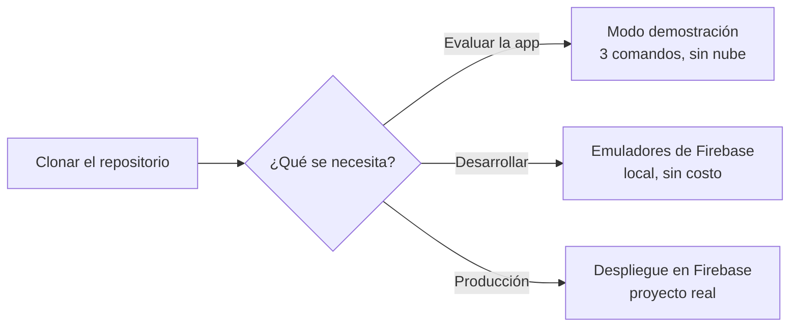

# 6. Guía de despliegue

## 6.1 Requisitos

| Herramienta | Versión | Verificación |
|---|---|---|
| Flutter SDK | 3.19 o superior | `flutter --version` |
| Node.js | 20 LTS | `node --version` |
| Firebase CLI | 13 o superior | `firebase --version` |
| Cuenta de Firebase | Plan **Blaze** | Cloud Functions v2 lo exige |

## 6.2 Rutas de ejecución



## 6.3 Modo demostración (sin nube)

```bash
git clone https://github.com/sgrlrichterl/inmovisita.git
cd inmovisita/mobile
flutter pub get
flutter run
```

`DEMO_MODE` está activo por defecto: la app siembra ocho inmuebles en SQLite y acepta `asesor@inmovisita.co` / `demo1234`. Todo el flujo —catálogo, registro, calificación y cola de salida— funciona; solo se omite el envío a la nube.

## 6.4 Desarrollo con emuladores

```bash
# 1. Compilar las funciones
cd backend/functions
npm install
npm run build

# 2. Configurar el proyecto y levantar los emuladores
cd ..
cp .firebaserc.example .firebaserc          # coloque un projectId, p. ej. inmovisita-demo
firebase emulators:start --only functions,firestore,auth,storage
```

En otra terminal, sembrar datos y usuarios:

```bash
cd inmovisita
export FIRESTORE_EMULATOR_HOST=localhost:8080
export FIREBASE_AUTH_EMULATOR_HOST=localhost:9099
node scripts/sembrar_catalogo.js inmovisita-demo
```

Ejecutar la app contra el emulador:

```bash
cd mobile
flutter run \
  --dart-define=DEMO_MODE=false \
  --dart-define=API_BASE_URL=http://10.0.2.2:5001/inmovisita-demo/us-central1/api \
  --dart-define=FIREBASE_API_KEY=demo-key
```

| Plataforma | Dirección del anfitrión |
|---|---|
| Emulador de Android | `10.0.2.2` |
| Simulador de iOS | `localhost` |
| Dispositivo físico en la misma red | IP local de la máquina (`ipconfig` / `ifconfig`) |

La consola de los emuladores queda en http://localhost:4000.

## 6.5 Despliegue en producción

### Paso 1 — Crear el proyecto

1. Consola de Firebase → **Agregar proyecto**.
2. Activar **Authentication** con el proveedor *Correo electrónico/contraseña*.
3. Crear **Cloud Firestore** en modo producción, región `us-central1` (la más cercana a Colombia con menor costo).
4. Activar **Cloud Storage**.
5. Cambiar al plan **Blaze** y fijar un presupuesto con alerta en Google Cloud Billing.

### Paso 2 — Publicar reglas e índices

```bash
cd backend
cp .firebaserc.example .firebaserc          # coloque su projectId real
firebase deploy --only firestore:rules,firestore:indexes,storage
```

Los índices compuestos tardan unos minutos en construirse; el `pull` fallará hasta que terminen.

### Paso 3 — Desplegar las funciones

```bash
cd functions
npm install
npm run build
cd ..
firebase deploy --only functions
```

La CLI imprime la URL de la API:

```
Function URL (api): https://us-central1-<projectId>.cloudfunctions.net/api
```

### Paso 4 — Sembrar el catálogo y los usuarios

```bash
export GOOGLE_APPLICATION_CREDENTIALS=/ruta/clave-servicio.json
node scripts/sembrar_catalogo.js <projectId>
```

Para promover a un usuario a coordinador, invocar `asignarRol` desde una sesión con rol `admin` (el primer administrador se crea manualmente con `setCustomUserClaims` desde una consola de administración).

### Paso 5 — Compilar el cliente

```bash
cd mobile

# Android
flutter build appbundle --release \
  --dart-define=DEMO_MODE=false \
  --dart-define=API_BASE_URL=https://us-central1-<projectId>.cloudfunctions.net/api \
  --dart-define=FIREBASE_API_KEY=<clave-web-del-proyecto>

# iOS
flutter build ipa --release \
  --dart-define=DEMO_MODE=false \
  --dart-define=API_BASE_URL=https://us-central1-<projectId>.cloudfunctions.net/api \
  --dart-define=FIREBASE_API_KEY=<clave-web-del-proyecto>
```

Los artefactos quedan en `build/app/outputs/bundle/release/` y `build/ios/ipa/`.

## 6.6 Verificación posterior al despliegue

```bash
# 1. La API responde
curl https://us-central1-<projectId>.cloudfunctions.net/api/v1/salud
# → {"estado":"ok","version":"1.0.0","hora":...}

# 2. Sin token debe rechazar
curl -i https://us-central1-<projectId>.cloudfunctions.net/api/v1/sync/pull?desde=0
# → HTTP/2 401  {"error":{"message":"Token ausente"}}

# 3. Con token válido debe responder cambios
curl -H "Authorization: Bearer <idToken>" \
  "https://us-central1-<projectId>.cloudfunctions.net/api/v1/sync/pull?desde=0"
```

**Lista de comprobación**

- [ ] `/v1/salud` responde `200`.
- [ ] Una petición sin token responde `401`.
- [ ] Un asesor no ve las visitas de otro asesor.
- [ ] Un asesor recibe `403` en `/v1/leads`.
- [ ] Registrar una visita en modo avión y recuperar la red la sube sola.
- [ ] Reenviar el mismo `operacionId` no crea un duplicado.
- [ ] El `scoreLead` almacenado es el del servidor, no el enviado.
- [ ] Un lead caliente genera notificación al coordinador.
- [ ] El presupuesto de facturación tiene alerta configurada.

## 6.7 Reversión

```bash
# Revertir una función a la versión anterior
firebase functions:delete api --region us-central1
git checkout <commit-anterior> && cd backend && firebase deploy --only functions
```

Las reglas de Firestore conservan historial de versiones en la consola y pueden restaurarse desde allí. La base de datos no se ve afectada por una reversión de funciones: el esquema de documentos es compatible hacia atrás mientras no se eliminen campos.

## 6.8 Operación

| Aspecto | Dónde se observa |
|---|---|
| Registros de la API | `firebase functions:log` o Cloud Logging |
| Latencia y errores | Cloud Monitoring, métricas de Cloud Functions |
| Costo acumulado | Google Cloud Billing, con alerta de presupuesto |
| Salud de la sincronización | Colección `metricas_diarias` y `/v1/metricas` |
| Cola atascada en un dispositivo | Pantalla *Sincronización* de la app (pendientes, fallidos, último error) |
