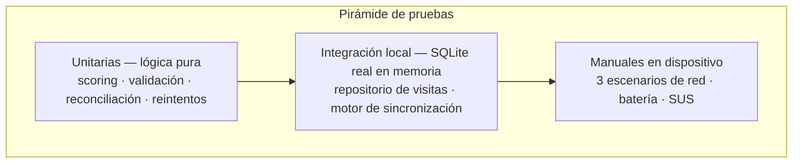

# 7. Estrategia de pruebas y resultados

## 7.1 Enfoque

La arquitectura se diseñó **para poder probarse**: la lógica de negocio vive en módulos puros (Dart y TypeScript sin dependencias de framework) y las dependencias externas se inyectan detrás de interfaces. La consecuencia práctica es que las reglas críticas —calificación de leads, validación, reconciliación de versiones, política de reintentos— se verifican **sin emuladores, sin credenciales y sin dispositivo**, en segundos, en cada `push`.



## 7.2 Suites automatizadas

| Ubicación | Tecnología | Qué cubre |
|---|---|---|
| `backend/functions/test/scoring.test.ts` | Jest | Modelo de puntaje: escenario nulo, escenario ideal, acotamiento 0–100, tramos de capacidad, claves de checklist desconocidas, umbrales, consistencia del desglose |
| `backend/functions/test/validacion.test.ts` | Jest | Estructura del sobre, entidades y operaciones no soportadas, normalización de texto y teléfono, rangos, recorte de observaciones y —lo esencial— que el servidor ignore `asesorUid` y `scoreLead` enviados por el cliente |
| `backend/functions/test/reconciliacion.test.ts` | Jest | Las cinco reglas de decisión del servidor y la monotonía del contador de revisión |
| `backend/functions/test/metricas.test.ts` | Jest | Agregación de indicadores y conversión horaria a `America/Bogota` |
| `mobile/test/domain/calcular_score_lead_test.dart` | flutter_test | Espejo de las pruebas de scoring del servidor (paridad de algoritmo) |
| `mobile/test/sync/conflict_resolver_test.dart` | flutter_test | Las siete ramas del resolvedor, incluida la tolerancia de reloj |
| `mobile/test/sync/retry_policy_test.dart` | flutter_test | Progresión exponencial, tope, franja del jitter y corte tras 5 intentos |
| `mobile/test/data/visita_repository_test.dart` | flutter_test + `sqflite_common_ffi` | Flujo offline sobre **SQLite real en memoria**: escritura y encolado atómicos, calificación al guardar, identificadores únicos, resumen e incremento de revisión, y las cuatro validaciones de negocio |
| `mobile/test/sync/sync_engine_test.dart` | flutter_test + doble de `SyncApi` | Ciclo completo: omisión sin backend o sin red, envío exitoso con marcado de sincronizada, rechazo permanente, fallo de red que conserva la cola, y avance del cursor con aplicación de cambios remotos |

## 7.3 Resultados medidos

Ejecución de la suite del backend en este repositorio:

```
$ cd backend/functions && npm test

PASS test/validacion.test.ts
PASS test/scoring.test.ts
PASS test/metricas.test.ts
PASS test/reconciliacion.test.ts
-------------------|---------|----------|---------|---------|-------------------
File               | % Stmts | % Branch | % Funcs | % Lines | Uncovered Line #s
-------------------|---------|----------|---------|---------|-------------------
All files          |   96.21 |    79.27 |     100 |   96.39 |
 metricas.ts       |     100 |      100 |     100 |     100 |
 reconciliacion.ts |     100 |       90 |     100 |     100 | 48
 scoring.ts        |   98.07 |    88.46 |     100 |     100 | 79,119-120
 validacion.ts     |   92.45 |    73.23 |     100 |    92.3 | 28,31,73,76
-------------------|---------|----------|---------|---------|-------------------

Test Suites: 4 passed, 4 total
Tests:       32 passed, 32 total
Time:        5.364 s
```

Verificación de tipos en modo estricto:

```
$ npx tsc --noEmit
(sin errores)
```

Las suites del cliente se ejecutan con `cd mobile && flutter test`. El flujo de integración continua ([`.github/workflows/ci.yml`](../.github/workflows/ci.yml)) corre en cada `push` y `pull request`: instalación de dependencias, `tsc --noEmit`, `npm test`, `flutter pub get`, `flutter analyze` y `flutter test`. El estado visible en la insignia del `README` es el resultado real de esa ejecución sobre el repositorio publicado.

## 7.4 Trazabilidad requisito → prueba

| # | Requisito | Prueba que lo evidencia |
|---|---|---|
| R1 | Registrar una visita completa sin conexión | `visita_repository_test.dart` → *"guarda la visita y encola su envío en la misma operación"* |
| R2 | Ninguna operación se pierde ante un corte | `sync_engine_test.dart` → *"un fallo de red conserva la operación para reintentarla"* |
| R3 | Un reenvío no duplica registros | `visita_repository_test.dart` → *"el identificador se genera en el dispositivo"* + `reconciliacion.test.ts` |
| R4 | El lead se califica automáticamente | `calcular_score_lead_test.dart` y `scoring.test.ts` |
| R5 | El servidor no confía en el dispositivo | `validacion.test.ts` → *"toma el asesor del token"*, *"no confía en el puntaje enviado"* |
| R6 | Las escrituras concurrentes no pierden datos en silencio | `conflict_resolver_test.dart` → *"escritura concurrente real se marca como conflicto"* |
| R7 | Los reintentos no saturan el backend | `retry_policy_test.dart` → progresión, tope y jitter |
| R8 | Solo se descargan los cambios nuevos | `sync_engine_test.dart` → *"aplica los cambios recibidos y avanza el cursor"* |
| R9 | Un asesor no accede a datos de otro | `firestore.rules` + filtrado por rol en `obtenerCambios` (verificación manual, lista de comprobación de `06-despliegue.md`) |

## 7.5 Protocolo de pruebas en dispositivo (Paso 3 del objetivo)

Pendiente de ejecución en la fase de campo; el instrumento queda definido aquí para que sea replicable.

**Muestra:** 6 asesores, 2 semanas, dispositivos Android de gama media y un iPhone.

**Escenarios de red:** (A) modo avión durante toda la jornada; (B) señal intermitente en zona rural; (C) 4G estable en zona urbana.

| Métrica | Instrumento | Línea base (proceso manual) | Meta |
|---|---|---|---|
| Tiempo de registro por visita | Marca de tiempo en la app | ≈ 6 min (papel + retranscripción) | ≤ 3 min |
| Retranscripciones al CRM | Conteo del coordinador | 1 por visita | 0 |
| Latencia hasta el lead visible | `fechaRegistro` vs. `updatedAt` del servidor | Horas o día siguiente | < 5 min tras recuperar señal |
| Operaciones perdidas | Conteo en `outbox` con estado `fallido` | — | 0 |
| Consumo de batería | Android Battery Historian / Xcode Energy | — | < 4 % por jornada de 8 h |
| Usabilidad percibida | Escala SUS (10 ítems) | — | ≥ 75 |

**Análisis previsto:** prueba t pareada sobre el tiempo de registro (línea base vs. app), con tamaño del efecto (d de Cohen) y reporte del intervalo de confianza al 95 %. La línea base se levanta con cronometraje directo durante la primera semana, antes de introducir la aplicación.

## 7.6 Deuda de pruebas reconocida

- **Reglas de Firestore:** conviene añadir pruebas con `@firebase/rules-unit-testing` sobre el emulador, para verificar de forma automatizada que un asesor no puede leer visitas ajenas.
- **Pruebas de widget:** las pantallas se validan hoy de forma manual; falta cobertura de `RegistrarVisitaPage` con `WidgetTester`.
- **Pruebas de extremo a extremo:** un escenario `integration_test` que arranque la app contra los emuladores cerraría el ciclo completo dispositivo → nube → dispositivo.
- **Carga:** falta simular 50 dispositivos sincronizando simultáneamente para validar empíricamente el efecto del jitter y el límite de instancias.
